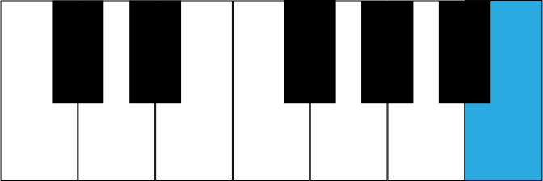

# Music

## Other

- **In music, what is an accidental?** A note that isn't in the current scale
- **In music, what does the double sharp do?** Raise a note by two half steps
- **In music, what does the double flat do?** Lower a note by two half steps
- **In music, what does a sharp do?** Raise a note by a half steps
- **In music, what does a flat do?** Lower a note by a half steps
- **In music, what does a natural do?** Cancels out any accidental
- **In music, what does a dot mean on a note?** Add one half of its length
- **In music, what does a note with multiple dots mean?** Each dot adds one half the length of the previous notes value
- **In music, what do tied notes mean?** As one extended note
- **In music, what is a tuplet?** An irregular note division
- **In music, what does the number mean in a tuplet?** What the division is
- **In music, how do you calculate the duration of each note in a tuplet?** Take the division number and play that number of notes in the time it would usually take to play one less
- **In music, what is measure?** The grouping of notes
- **In music, what are barlines?** The lines between measures
- **In music, what do the two and bottom numbers in a time signature mean?** The top number is the number of beats per measure, and the bottom number is the note division that's considered one beat.
- **In music, what is a quaver?** An eighth note
- **In music, what is a crotchet?** A quarter note
- **In music, what is a compound time signature?** A time signature that can be counted multiple ways, usually in reference to groups of three eighth notes
- **In music, what is a beam?** A flag connecting notes indicating rhythmic grouping
- **In music, what is a tie?** A connection between notes of the same pitch indicating they should be played as one note
- **In music, what is a slur?** A connection between notes of different pitches indicating they should be played with legato
- **In music, what is legato?** A smooth transition between notes
- **In music, what are the rules about when to use beams?** To group notes within beats
- **In music, what are the rules about when to use a tie?** To connect notes across beats
- **In music, what is a half step?** A step between two notes, regardless of color
- **In music, what is a whole step?** Two half steps
- **In music, what is the formula for a major scale?** `WWHWWWH`
- **In music, what is the formula for a minor scale?** `WHWWHWW`
- **In music, what is the order of the circle of fifths in the flat direction?** C, G, D, A, E, B, F#, C#
- **In music, what is the order of the circle of fifths in the sharp direction?** C, F, B♭, E♭, A♭, D♭, G♭, C♭
- **In music, what is the rule of nines?** That an interval and it's inversion always add up to nine
- **In music, what does it mean to invert an interval?** Move the lower note up by an octave, making it the higher note
- **In music, what is the inversion of a 2nd?** 7th
- **In music, what is the inversion of a 3rd?** 6th
- **In music, what is the inversion of a 4th?** 5th
- **In music, what is the inversion of a 5th?** 4th
- **In music, what is the inversion of a 6th?** 3rd
- **In music, what is the inversion of a 7th?** 2nd
- **In music, what are scale degrees?** The position of notes on the scale
- **In music, what do you call the position of notes on the scale?** Scale degrees
- **In music, what is an interval?** The distance in scale degrees between two notes
- **In music, what is a diminished interval?** An interval that's a half-step smaller than a perfect interval
- **In music, what is an augmented interval?** An interval that's a half-step larger than a perfect interval
- **In music, what are the perfect intervals?** Unison, 4th, 5th, Octave
- **In music, what are the major and minor intervals?** Second, Third, Sixth, Seventh
- **In music, what is the difference between the major and minor intervals?** Major intervals have the tonic on the bottom, minor intervals have the tonic on top
- **In music, why are the octave and unison called perfect?** Because the pitch doesn't change
- **In music, why are the perfect fourth and perfect fifth called that?** Because those intervals have a high degree of consonance
- **In music, what happens to the frequency when you move a note up one octave in pitch?** The frequency doubles
- **In music, how many half steps is a perfect fourth?** Five
- **In music, how many half steps is an augmented fourth?** Six
- **In music, how many half steps is a diminished fourth?** Four
- **In music, what is the tonic?** The first key of a scale
- **In music, what is the inflection of an interval?** Whether it's perfect, major, minor, augmented, or diminished
- **In music, how do you determine the type of interval?**
    1. Determine the difference in scale degrees 
    2. Remove all accidentals
    3. 8 is perfect octave
    4. 0 is perfect unison
    5. If the interval uses F or B, it's perfect
    6. Otherwise, it's either an augmented fourth or diminished fifth
    7. If the top note is in the major key of the bottom note, it's major
    8. If the bottom note is in the major key of the top note, it's minor
    9. Add back the accidentals and determine if the interval is major, minor, augmented, or diminished (accidentals never change the distance of the interval, only the inflection)
- **In music, what is a triad?** A chord with three notes
- **In music, what is tetrad?** A chord with four notes
- **In music, what is the lowest note in a chord when it is not inverted called?** Root
- **In music, what is a chord in when it is not inverted?** Root position
- **In music, what is a diminished triad?** A chord with two minor thirds
- **In music, what is a minor triad?** A chord with a major third on top of a minor third
- **In music, what is a major triad?** A chord with a minor third on top of a major third
**In music, what is an augmented triad?** A chord with two majors thirds

## Keyboard

### C

### C# D♭

### D

### D# E♭

### E

### F

### F# G♭

### G

### G# A♭

### A

### A# B♭

### B

