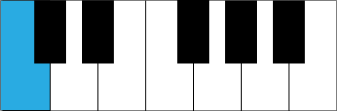
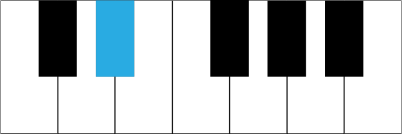

# Music

## Other

- **In music, what is an accidental?** A note that isn't in the current scale
- **In music, what does the double sharp do?** Raise a note by two half steps
- **In music, what does the double flat do?** Lower a note by two half steps
- **In music, what does a sharp do?** Raise a note by a half steps
- **In music, what does a flat do?** Lower a note by a half steps
- **In music, what does a natural do?** Cancels out any accidental
- **In music, what does a dot mean on a note?** Add one half of its length
- **In music, what does a note with multiple dots mean?** Each dot adds one half the length of the previous notes value
- **In music, what do tied notes mean?** As one extended note
- **In music, what is a tuplet?** An irregular note division
- **In music, what does the number mean in a tuplet?** What the division is
- **In music, how do you calculate the duration of each note in a tuplet?** Take the division number and play that number of notes in the time it would usually take to play one less
- **In music, what is measure?** The grouping of notes
- **In music, what are barlines?** The lines between measures

## Keyboard

### C

### C# D♭

### D

### D# E♭

### E

### F

### F# G♭

### G

### G# A♭

### A

### A# B♭

### B

