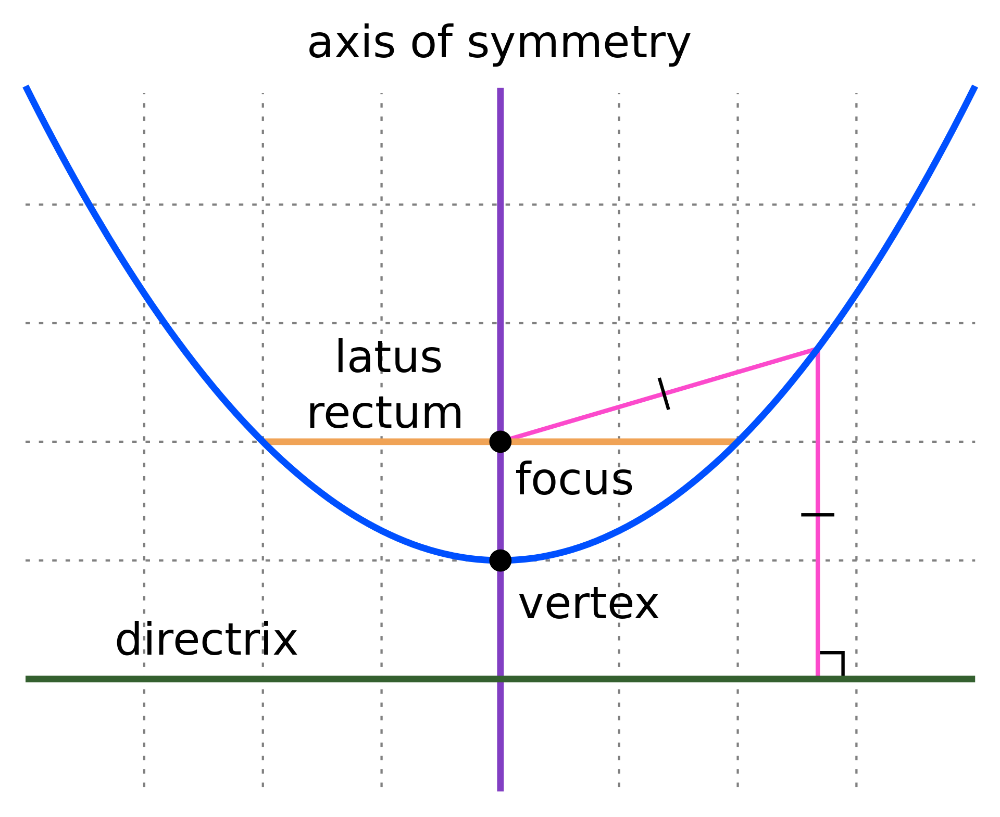

# Math

- **What is a linear equation?** An equation for a straight line. The single-variable form is `ax + b = 0`.
- **What is a quadratic function?** A single-variable quadratic function has the form `ax^2 + bx + c`. The graph of a univariate quadratic function is a parabola.
- **What is an exponential function?** `f(x)=a^x` where `a > 0`, `a != 1`, and `a` is constant. `2^x` is called "an exponential function to the base of 2".
- **What is a polynomial?** An expression of the form `p(x) = a_0 + a_1x + a_2x^2 + ... + a_nx^n`. In other words, an expression with variables and coefficients using only addition, subtraction, multiplication, and non-negative integer exponentiation of variables.
- **What is a coefficient?** A multiplicative factor in a polynomial. (E.g., in `7x^2 - 3xy + 1.5 + y` `7` and `-3` are the coefficients, and `1.5` is a constant coefficient.)
- **What is a monomial, binomial, and trinomial?** A monomial is a single-term polynomial, or a single term of a polynomial. Binomial and trinomial are two and three term polynomials respectively.
- **In a polynomial what's the degree of a term?** The power of the term, as in "a term of degree two" or "a two-degree term". The degree of the leading term determines the degree of the polynomial, as in "a polynomial of degree two".
- **What is a parabola?** 

    
- **What is the Cartesian product?** All permutations of the members of two sets.
- **What is an open interval?** An interval that does not include its endpoints.
- **What is a closed interval?** An interval that does include its endpoints.
- **What is a half-open interval?** An interval that includes only one of its endpoints.
