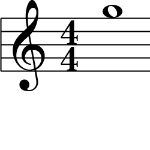
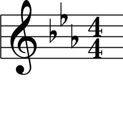
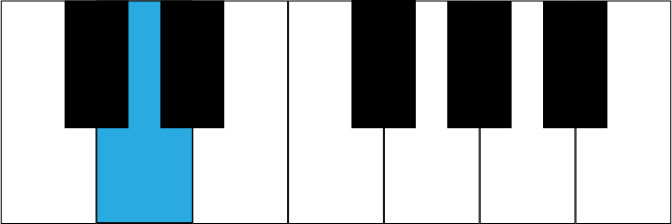
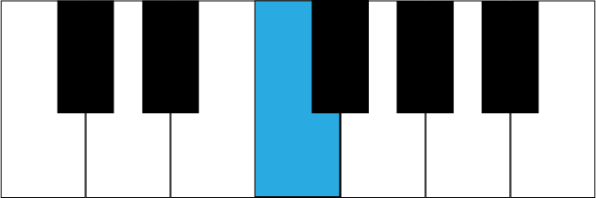

# Music Theory

## Stave

- **In music theory, what is a stave?** The lines representing pitches
- **In music theory, what is a clef?** The symbol that determines the pitch of the lines in the stave
- **In music theory, what is measure?** The rhythmic grouping of notes
- **In music theory, what is a bar?** A synonym for measure
- **In music theory, what are barlines?** The lines between measures

## Meta

- **In music theory, what do the top and bottom numbers in a time signature mean?** Beats per measure over note that's one beat.
- **In music theory, what is a compound time signature?** A time signature that can be counted multiple ways (usually in groups of three eighth notes)

## Notes

- **In music theory, what is a quaver?** Eighth note
- **In music theory, what is a semiquaver?** Sixteenth note
- **In music theory, what is a crotchet?** Quarter note
- **In music theory, what is the mnemonic for the treble clef lines?** Every good boy deserves fudge
- **In music theory, what is the mnemonic for the treble clef spaces?** FACE
- **In music theory, what is the mnemonic for the bass clef lines?** Good boys do fine always
- **In music theory, what is the mnemonic for the bass clef spaces?** All cows eat grass

### Symbols

- **In music theory, what does the double sharp do?** Raise a note by two half steps
- **In music theory, what does the double flat do?** Lower a note by two half steps
- **In music theory, what is an accidental?** A note that isn't in the current scale (indicated by a sharp or flat symbol)
- **In music theory, what does a sharp do?** Raise a note by a half steps
- **In music theory, what does a flat do?** Lower a note by a half steps
- **In music theory, what does a natural do?** Cancels a previous accidental for a note
- **In music theory, what does a dot mean on a note?** Add half its length
- **In music theory, what does a note with multiple dots mean?** Each dot adds half the length of the previous note

### Divisions

- **In music theory, what is a tuplet?** Beamed notes with a number above to be played at an irregular rhythm
- **In music theory, how does a tuplet ratio work?** The number of notes to the number of normal notes to be played in the same amount of time as
- **In music theory, how do you calculate the duration of each note in a tuplet with one number?** The number of notes in the time it would normally take to play one less
- **In music theory, what is a beam?** Flag connecting notes indicating a rhythmic grouping
- **In music theory, what is a tie?** Line grouping notes of the same pitch to be played as one extended note
- **In music theory, what is a slur?** Line grouping notes of different pitches indicating they should be played with legato
- **In music theory, what is legato?** A smooth transition between notes
- **In music theory, when should notes be beamed?** To group notes within beats
- **In music theory, when should notes be tied?** To extend notes across beats

## Scales

- **In music theory, what is the position of a note relative to the root called?** Scale degrees
- **In music theory, what are scale degrees?** The position of a notes relative to the root
- **In music theory, what is a half step?** A step between two notes (regardless of scale)
- **In music theory, what is a whole step?** Two half steps
- **In music theory, what is the formula for a major scale?** `WWHWWWH`
- **In music theory, what is the formula for a minor scale?** `WHWWHWW`
- **In music theory, what are the major keys of the circle of fifths in the flat (right) direction?** C, G, D, A, E, B, F#, C#
- **In music theory, what are the minor keys of the circle of fifths in the flat (right) direction?** a, e, b, f#, c#, g#, d#
- **In music theory, what are the major keys of the circle of fifths in the sharp (left) direction?** C, F, B♭, E♭, A♭, D♭, G♭, C♭
- **In music theory, what are the minor keys of the circle of fifths in the sharp (left) direction?** a, d, g, c, f, b♭, e♭
- **In music theory, why is the circle of fifths called that?** Because each key to the right is a perfect fifth away from the previous key

## Intervals

- **In music theory, what is an interval?** The distance in scale degrees between two notes
- **In music theory, what is inverting an interval?** Moving the lower note up an octave, making it the higher note
- **In music theory, what is the rule of nines?** An interval and its inversion always add up to nine
- **In music theory, what is the inversion of a 2nd?** 7th
- **In music theory, what is the inversion of a 3rd?** 6th
- **In music theory, what is the inversion of a 4th?** 5th
- **In music theory, what is the inversion of a 5th?** 4th
- **In music theory, what is the inversion of a 6th?** 3rd
- **In music theory, what is the inversion of a 7th?** 2nd
- **In music theory, what does diminished with intervals?** A half-step fewer
- **In music theory, what does augmented with intervals?** A half-step more
- **In music theory, how many scale degrees is a fifth?** Five
- **In music theory, what is the frequency ratio of a perfect fifth? `3:2`
- **In music theory, what are the perfect intervals?** Unison, Perfect Fourth, Perfect Fifth, Octave
- **In music theory, what are the intervals that can be major or minor?** Second, Third, Sixth, Seventh
- **In music theory, what is the tonic?** The first note of a scale
- **In music theory, what is the difference between the major and minor intervals?** Major intervals have the tonic on the bottom, minor intervals have the tonic on top
- **In music theory, why are the octave and unison called perfect?** Because the pitch doesn't change
- **In music theory, all fourths and fifths are perfect except for those between which two keys?** F and B (the fourth has F on the bottom, the fifth has B on the bottom)
- **In music theory, why are the perfect fourth and perfect fifth called that?** Because those intervals have a high degree of consonance
- **In music theory, what happens to the frequency when you move a note up one octave in pitch?** The frequency doubles
- **In music theory, how many half steps is a perfect fifth?** Seven
- **In music theory, how many half steps is a perfect fourth?** Five
- **In music theory, how many half steps is an augmented fourth?** Six
- **In music theory, how many half steps is a diminished fourth?** Four
- **In music theory, what is the difference between an augmented fourth and a diminished fifth?** They're identical
- **In music theory, what is the tonic?** The first key of a scale
- **In music theory, what is the inflection of an interval?** Whether it's perfect, major, minor, augmented, or diminished
- **In music theory, how do you determine the type of interval?**
    1. Determine the difference in scale degrees 
    2. Remove all accidentals
    3. 8 is perfect octave
    4. 0 is perfect unison
    5. If the interval is a fifth, if it's between F and B, it's either an augmented fourth or diminished fifth, otherwise it's perfect
    7. If it's a second, third, sixth, or seventh, then if the top note is in the major key of the bottom note, it's major, otherwise if the bottom note is in the major key of the top note it's minor
    8. Add back the accidentals and determine if the interval is major, minor, augmented, or diminished (accidentals never change the distance of the interval, only the inflection)

### Chords

- **In music theory, what is a triad?** A chord with three notes
- **In music theory, what is tetrad?** A chord with four notes
- **In music theory, what is the lowest note in a chord when it is not inverted called?** Root
- **In music theory, what is a chord in when it is not inverted?** Root position
- **In music theory, what is a diminished triad?** A chord with two minor thirds
- **In music theory, what is a minor triad?** A chord with a major third on top of a minor third
- **In music theory, what is a major triad?** A chord with a minor third on top of a major third
- **In music theory, what is an augmented triad?** A chord with two major thirds
- **In music theory, what is a diatonic triad?** A chord in the current key
- **In music theory, what are the diatonic triads starting from the root chord?** Tonic, Supertonic, Mediant, Subdominant, Dominant, Submediant, Leading-Tone
- **In music theory, what is a seventh chord?** A triad, plus a seventh interval above the chord's root
- **In music theory, what is a major seventh chord?** A major triad, plus a major seventh
- **In music theory, what is a dominant seventh?**A major triad, plus a minor seventh
- **In music theory, what is a minor seventh?**A minor triad, plus a minor seventh
- **In music theory, what is a half-diminished seventh?** A diminished triad, plus a minor seventh
- **In music theory, what is a diminished seventh?** A diminished triad, plus a diminished seventh
- **In music theory, what is the third of a chord?** The note at the third scale degree
- **In music theory, what is the fifth of a chord?** The note at the fifth scale degree
- **In music theory, what is the seventh of a chord?** The note at the seventh scale degree

## Accents

### Strong

### Staccato

### Staccatissimo

## Normal

## Legato

## Notes

### One-Hundred-Twenty-Eighth Note

### Sixty-Fourth Note

### Thirty-Second Note

### Sixteenth Note

### Eighth Note

### Quarter Note

### Half Note

### Whole Note

### Double Whole Note

### Eighth Note

### Quarter Note

### Half Note

### Whole Note

### Double Whole Note

## Rests

### One-Hundred-Eighth Rest

### Sixty Fourth Rest

### Thirty-Second Rest

### Sixteenth Rest

### Eighth Rest

### Quarter Rest

### Whole or Half Rest

### Double Whole Rest

### Other

#### Alto or Tenor Clef

#### Bass Clef

#### Double Flat

#### Double Sharp

#### Flat

#### Natural

#### Sharp

#### Treble Clef

## Keys

## Key Signatures

## Keyboard

### C

### C# D♭

### D

### D# E♭

### E

### F

### F# G♭

### G

### G# A♭

### A

### A# B♭

### B

