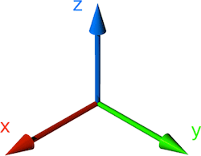
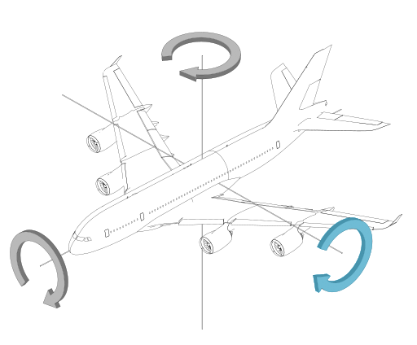
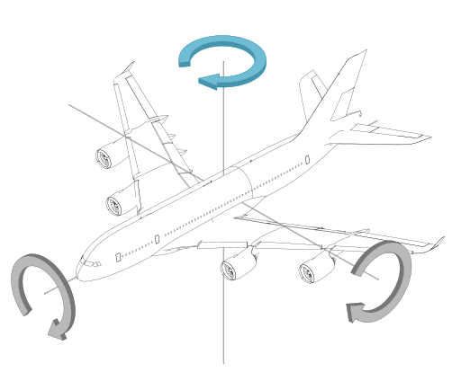
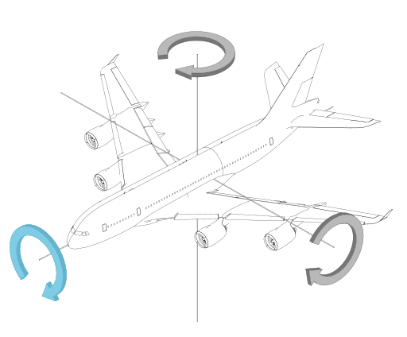

# 3D

- **In computer graphics, what is a voxel?** A value in a 3D grid
- **In computer graphics, what is an EXR file?** Multichannel render files (that assist in compositing)

## Axes

### Pitch

Rotate around the Y-axis.

### Yaw

Rotate around the Z-axis.

### Roll

Rotate around the X-axis.

### Mnemonic

- Y-Z, R-X, P-Y
- ZY, XR, YP
