# Design

- **According to *The Elements of Typographic Style*, what range of characters per line should a single column of text have?** 45 to 75
- **According to *The Elements of Typographic Style*, multiple columns of text should have in what range of characters per line?** 40 to 50
- **According to *The Elements of Typographic Style*, how many characters per line is ideal for a single column of text?** 66
- ***The Elements of Typographic Style* suggests 45-75 characters per line for a single column of text, how many words does that typically come out to?** 8 to 13
- ***The Elements of Typographic Style* says 66 characters per line is ideal for a single column of text, how many words does that typically come out to?** 12
- ***The Elements of Typographic Style* suggests 40-50 characters per line for a multiple columns of text, how many words does that typically come out to?** 7 to 9
- **In typography, what is leading?** Line height
- **In typography, what is kerning?** Letter spacing
- **In typography, what is measure?** Line length

## Blend Modes

Some memorization helpers.

### Groups

- **What are the really bright blend modes, from darkest to lightest?** Screen, color dodge, linear dodge (South California Lamborghini)

    
    
    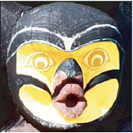

- **What are the intense bright blend modes, from least contrast to highest contrast?** Linear Light, Hard Light, Vivid Light, Pin Light (Long-Haired Vice President)

    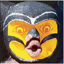
    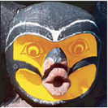
    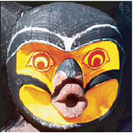
    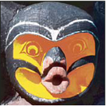

- **What are the four tint blend modes, from lightest to darkest?** Overlay, Soft Light, Color, Hue (Open Sound Control Hardware)

    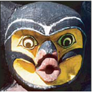
    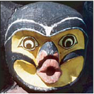
    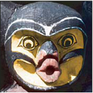
    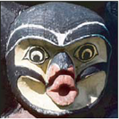

- **What is the difference between hard light and overlay blend modes?** Both use screen on light pixels and multiply on dark pixels, but overlay determines this using the base color and hard light uses the blend color (order hard liquor)

    
    

- **What are the four high contrast blend modes from lightest to darkest?** Darken, Color Burn, Multiply, Linear Burn (DC Marvel Logos)

    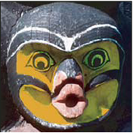
    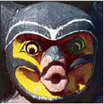
    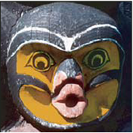
    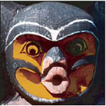

### Pairs

- **What are the two blend modes that leave the image looking largely the same, from darkest to lightest?** Hue, Color

    
    

- **What are the hard separation blend modes from darkest to lightest?** Difference and exclusion (difference is darker)

    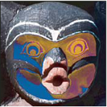
    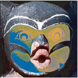

### Other

- **Vivid Light**: Color burn or color dodge based on the blend color ("Vi Vi" almost mark of the beast, for more extreme burning and dodging)

    

- **Hard Light**: Multiply or screen based on the blend color ("H" for "home", the default way of doing things)

    

- **Soft Light**: Lightened like dodging or darken like burning based on the blend color ("S" for "special" and "spotlight")

    

- **Pin Light**: Darken and lighten simultaneously (Dark and light with a pin between them)

    

### Mnemonics

- Linear: Uses brightness
- Color: Uses contrast

#### Identifying

- Linear Light (Loose Edges), Hard Light (Hard Edges), Vivid Light (Mark of the best, Dodge & Burn), Pin Light (Poured paint)

    
    
    
    

- Overlay (Yellow), Soft Light (Spotlight), Hue (Dark Green), Color (Dark Yellow)

    
    
    
    

- Color Dodge (Color Eye), Linear Dodge (Low-Key Eye)

    
    

- Difference (Dirty Brown), Exclusion (Green Egg)

    
    

- Screen (Lighter lighten)

    
