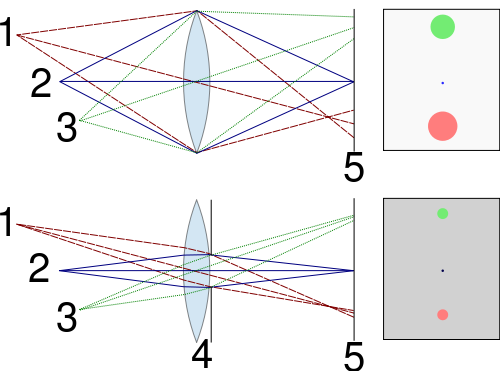

# Photography

## Exposure

- **In photography, what does ISO stand for?** The International Organization for Standardization
- **In photography, what does ISO mean?** Light sensitivity
- **What are the four general ranges ISO can be broken into?**
    - 32--100: Lowest Noise
    - 100--400: Low Noise
    - 400--800: Medium Noise
    - 800--1600: High Noise
- **In photography, what is shutter speed?** How long the shutter is open measured in seconds (usually fractions of a second)
- **How do you reduce the amount of noise in a shot?** Reduce the ISO, which decreases stability
- **What is the relationship between stability and exposure?** The less stable you have to hold the camera, the noisier the image.
- **Why shoot in manual mode?** To have more control over the ISO value, to sacrifice stability to reduce noise

### AWB

- **What is AWB?** Auto White Balance
- **Why doesn't AWB matter when shooting RAW?** With the RAW file format the white balance can be adjusted later
- **When should you turn off AWB?** If your photo is too warm or too cool
- **Why is the white balance for cloudy orange?** Because light on a cloudy day is cool, so the cloudy setting warms it up
- **Why is the white balance for a light bulb blue?** Because light from a light bulb is warm, so the light bulb setting cools it down

## Focal Length

- **What is depth of field?** The distance between the nearest and farthest objects that are in focus
- **What is focal length?** The distance between where light convergence in the lens and the camera's sensor
- **What does focal length determine?** How wide a shot is
- **How is the zoom implementation different between a traditional camera and a mobile camera?** A mobile camera just crops in software, a traditional camera changes the focal length by moving the lens
- **How does increasing the focal length change the shot?** The larger the focal length, the more magnified and narrower the shot
- **Why does shrinking the aperature increase the depth of field?** Because it reduces the used part of the lens, which leads to less aberrations

    

### Lens

- **What is an f-number?** Aperture relative to focal length
- **What does dividing the focal length by the aperture calculate?** The diameter of the aperture
- **What happens when you increase the f-number?** The aperture gets smaller
- **How does the focal length and aperture differ in a telephoto lens?** It has a large focal length
- **How does the focal length and aperture differ in a wide-angle lens?** It has a small focal length
- **How does f-number affect depth of field?** A higher f-number means a deeper depth of field
- **How does f-number affect exposure?** A smaller f-number means a higher exposure

## iPhone

- **What is the aperture of an iPhone X?** f/1.8
- **How many cameras does the iPhone X have? What are they?** Two, a wide angle and telephoto camera
- **Which additional camera does the iPhone 12 have that the iPhone X doesn't?** Ultra wide
- **In photography, what is HDR?** Taking several photos at different exposures and combining them to get a more balanced result
- **What is the focal length of an iPhone X?** 28 mm

## Time

- **In photography, what is golden hour?** The time shortly before sunset or after sunrise when daylight is redder and softer
- **In photography, what is blue hour?** The time shortly before sunrise or after sunset when sunlight takes on a blue shade
